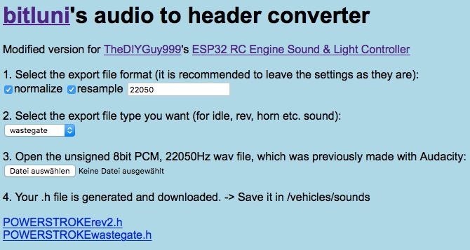
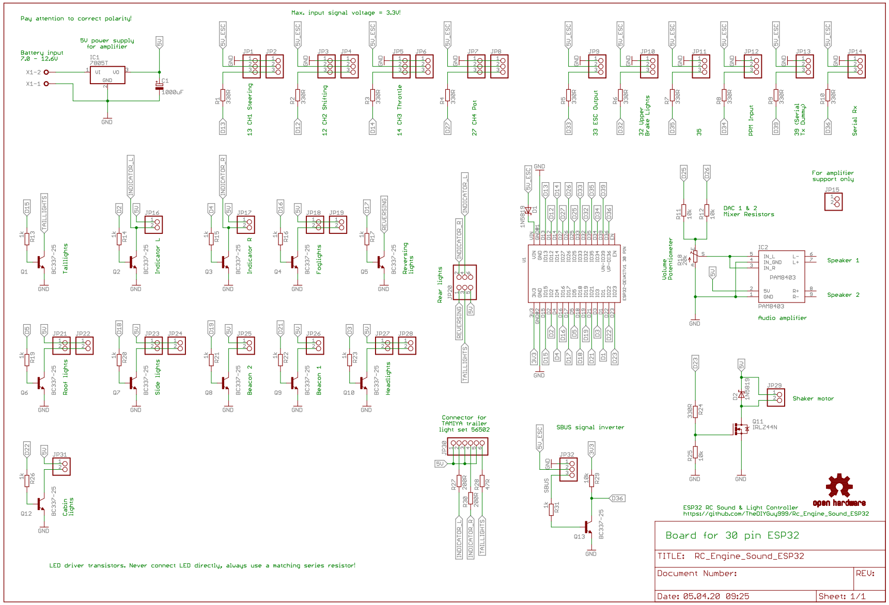

# This is an Arduino RC engine sound & light controller for ESP32
It's based on the ATmega 328 version: https://github.com/TheDIYGuy999/Rc_Engine_Sound
and on bitlunis Halloween example: https://github.com/bitluni/MotionPumpkin

Wiring and software installation instructions see further down.

Video series: https://www.youtube.com/playlist?list=PLGO5EJJClJBCjIvu8frS7LrEU3H2Yz_so

Discussion and support thread (in German): https://www.rc-modellbau-portal.de/index.php?threads/esp32-arduino-rc-sound-und-licht-controller.7183/

New: fully assembled, tested and working 30 pin SMD version, manufactured and pre-assembled by https://www.pcbway.com


Fully assembled, tested and working 30 pin version


## Features:
- Unique vehicle mass inertia simulation (connect your crawler type ESC to pin 33). Throttle output is altered during shifting of a mechanical 3 speed transmission for smooth shifting, gear protection and realistic sound. Works just fine with TAMIYA 3 speed transmissions. Should work as well with crawler 2 speed transmissions. The ESC is controlled by a state machine with the following states: driving forward & reverse (varible acceleration, depending on throttle position), neutral, braking forward & reverse (variable deceleration with fine granularity, according to "reverse throttle" position). It also allows to control the brake lights, the brake sound, the reversing light & the reversing beep sound properly. Acceleration & deceleration (coasting & braking) are adjustable separately for each gear to ensure maximum realism.
- Unique "virtual clutch" allows to rev the engine below an adjustable ESC output speed. Above, the clutch engages and ensures, that the engine sound is in synch with the wheel RPM. Sounds and behaves just great in combination with a shifting transmission!
- Simulated automatic transmission with torque converter (if your vehicle does not have a real shifting transmission)
- Simulated double clutch transmission
- simulated, manually shifted 3 speed transmission (new in v5.5)
- Virtual, switchable neutral allows to rev the engine while standing still
- Jake brake (simulated pneumatic engine brake, mainly used in US trucks)
- Tracked mode (dual throttle input on CH2 & CH3, for tanks, diggers etc. No ESC control support in this mode. (New in v4.5)
- Tank cannon sound & flash (New in v4.6)
- Triggering multiple latching and non latching actions (sounds, lights) per analog channel, using the rcTrigger library (New in v4.7, still experimental)
- Many selectable sounds: engine cranking, engine idling, engine revving, turbo whining, diesel ignition "knock", wastegate valve, horns, sirens, reversing beep, air brake, parking brake, gear shifting etc.
- Realistic engine sound is mixed together on the fly from up to 4 sounds: engine idling, turbo, wastegate (all with variable sampling rate), Diesel ignition knock (fixed sampling rate, so it does not vary in pitch)
- Load (throttle position) dependent volume sounds: idle, rev, Diesel knock
- Engine RPM dependent volume sounds: turbo, wastegate
- Dozens of engine & other sounds included, you can also compose your own, using Audacity and bitlunis conversion tool (link above)
- Engine RPM range and inertia adjustable, volume of all sounds adjustable, engine sounds separatly for load and idling.
- Many other paramerets can be adjusted. All adjustments are easily accessible in "adjustmentsXyz.h"
- Sound files up to 22'050Hz, 8bit, mono can be used
- Compatible input signals: PWM, PPM, SBUS (inverted & non inverted signals), IBUS
- Works best with a PAM8403 amplifier module, connected to pin 25 & 26, via 10kOhm resistors & a 10kOhm potentiometer (see schematic below)
- The engine RPM is calculated according to RC signal input on pin 13 *** CAUTION, 3.3V max. on all pins! *** 330 Ohm resistors on all I/O pins recommended!
- Non linear throttle curves can be generated in "curves.h"
- Light effects: headlights (high & low beam), tail lights, brake lights, fog lights, roof lights, cab lights, reversing light, indicators (turn signals), hazard lights, blue light etc. (max. 12 outputs)
- Engine vibration simulation, using a shaker motor with excentric weight: Strong vibration while cranking, medium wlile idling, slight while revving
- Adjustable volume (via remote)
- Use an ESP32, CPU frequency must be set to 240MHz
- Eagle schematic & board file included. Pre made Gerber files allow you to order your board easily.
- included, easy to use .wav to .h sound file converter
- Channels can easily be assigned, using "remoteSetup.h"
- Pre made configuration profiles for Flysky FS-i6X and Arduino Mirco RC remote (new in v.5.5)
- Variable length for horn & siren, using loop area in sound files (new in v5.6)
- BUS decoder for steering servo and shifting servo (connect servos to CH1 & CH2) pins
- Trailer coupler (5th wheel) servo can be connected to the CH4 pins (not in PWM communication mode)
- TAMIYA trailer presence switch can be connected to pin 32 (depending on "#define THIRD_BRAKLELIGHT" setting in "6_adjustmentsLights.h" tab)

## On the todo list:
- Your suggestions?

## Known issues:
- Arduino IDE 1.8.7 or older is not supported and will cause compiler errors!
- The ESP32 does not work on macOS Big Sur 11.x, but this issue can be fixed easily as described here: [Big Sur Fix](BigSurFix.md) (for v1.04)
- Under Windows 10 & macOS, there is a crash & reboot issue, if Espressif ESP32 board definition v1.05 is used. Use v1.04 instead!

## How to create new .h sound files:

### Audacity:
- import the WAV sound file you want in Audacity
- convert it to mono, if needed
- on the bottom left, select project frequency 22'050Hz
- search for a cyclic pattern in the idle sound (the amount of ignition pulses is usually the same as the cylinder number), cut the "idle" sample to exactly this length, have a close look at the zero crossings to avoid clicking noises. The loudest peak should always be at the end of the sample.
- do the same with the "rev" sound. It will be 2 - 4 times shorter than the "idle" sample, depending on the engine and rpm of the "rev" sample
- change the "Rate" (dropdown on the left of the sample) of the "rev" sample, until the length is the same as in the "idle" sample. This is very important!
- duplicate a part of the "rev" sample (the one with the original, unchanged "Rate" speed). This is the "knock" sample. Cut it to this max length: "Idle" length / number of cylinders / rpm range "MAX_RPM_PERCENTAGE" (usually 2 - 4 or 200 - 400%)
- adjust the volume of all samples, so that the entire dynamic range is used
- you may also want to apply high pass or low pass filters to fine tune the sound
- select > export audio > selected audio > WAV > 8-bit-PCM

### Convert the .wav file with the modified converting tool (new in v5.2):

- open the included "Audio2Header.html" converter in your browser
- adjust the export file format (no changes required)
- select the export file type, depending on the sound you are converting (idle, rev, horn etc.)
- open the wav file you want to convert
- a .h file is generated and downloaded
- move it to your "sketch/vehicles/sounds" directory

### Include the new header file with your sound in your vehicle preset, adjust settings until you are happy:
- include this .h file in "Adjustments.h" > "yourVehiclePreset.h"
- knock sound settings:
  - "dieselKnockInterval" = number of cylinders
  - uncomment "V8" for V8 engines, R6 for inline 6 engines or "V2" for V2 (Harley) engines
  - adjust "dieselKnockAdaptiveVolumePercentage" (how loud the "silent" knock pulses are compared with the loud ones), only active, if defined "V8", "R6"  or "V2"
- play with the other volumes, start-, end- and switch-points until you are happy
- the "rev" sound is optional and only active, if "REV_SOUND" is defined (// removed)
- adjust the transition from the "idle" to the "rev" sound, using "revSwitchPoint", "idleEndPoint", "idleVolumeProportionPercentage". This step is very important and can make a huge difference!

### Compile the new sketch:
- compile and upload the sketch in Arduino IDE
- the new sound should now be ready

## Schematic (use PDF for current version!):


## PCB
### Included PCB files:
- for 30 pin ESP32: advanced version with 11x LED driver transistors, inverting input for SBUS, double input connectors to avoid y-cables


- for 36 pin ESP32: simple version with direct output pin access via 330 Ohm resistors, 8x LED driver transistors (not recommended)


### Recommended manufacturor:
https://www.pcbway.com (including SMD assembling service, use Gerbers.zip for board, it also includes BOM. xlsx and CPL.xlsx, if you want to use the SMT assembling service)
How to order pre assembled boards see /Eagle_PCB/How To Order Your PCB.pdf

### Assembling tutorial (for the 36 pin version):
https://www.youtube.com/watch?v=Vfaz3CzecG4&list=PLGO5EJJClJBCjIvu8frS7LrEU3H2Yz_so&index=13

## Wiring:
### Before you begin:
- This device is not protected against wrong polarity!
- Always use series resistors for LED headers (except TAMIYA trailer header)
- Maximum input voltage on "Sig" pins = 3.3V (be careful with very old receivers, which may deliver 5V)
- It is recommended to use a fuse between your battery and the sound controller / ESC

### Supply for audio amplifier, shaker motor and LED:
- Use an Y-cable between your battery, your ESC and The "X1" terminal. Battery voltage range is 7 - 12.6V

### Supply for ESP32:
- The ESP32 is not supplied through the "X1" terminal
- It can be supplied through the Micro USB header
- or through the +V and GND pin row on the top of the board (the voltage is usually coming from the BEC in your ESC, which needs to be connected to the "ESC" header)

### ESC wiring:
- Connect a Hobbywing 1080 ESC to the ESC header (GND, V+ and Sig)
- Adjust the ESC parameters, using the programming card as described on the top of "Adjustments.h"
- I do not recommend any other ESC
- The ESC is controlled by the cound controller, rather than directly by the receiver. This allows to use the unique "virtual inertia" feature. NOTE: Use this feature at your own risk! I'm not responsible, if any damage is caused. It's running very stable and I never had an issue, but you never know.
- "escPulseSpan" can be used to limit the top speed of your vehicle. 500 = not limited, anything above 500 will limit the top speed

### Receiver wiring for PWM servo signals (the most common wiring):
- Channel assignment according to "remoteSetup.h" and remoteSetup.xlsx", easily adjustable (new in v5.5). It is important to plug in the wires according to the channel assignment
- CH5 & 6 are coming in via the "35" & PPM" headers
- At least one CH needs to be connected, using a 3 pin wire, so that GND and V+ are connected as well (receiver supply)
- CH1 - 4 headers are pairs, wired in parallel. This allows to feed servo signals through, eliminating the need for Y-cables
- Note that you need to change the configuration as described below, if you want to use this wiring method

### Receiver wiring for PPM signals:
- Internal channel assignment as above
- Connect a 3 pin wire fom your receiver PPM header to the RX (changed in v5.5, was PPM) header on the sound controller (Sig, V+, GND)
- Note that you need to change the configuration as described below, if you want to use this wiring method
- 8 channels can be read in this mode

### Receiver wiring for SBUS signals (recommended):
- Internal channel assignment as above
- Connect a 3 pin wire fom your receiver SBUS header to the SBUS header on the sound controller (Sig, V+, GND)
- The "Sig" pin on the SBUS header is 5V tolerant
- 13 channels can be read in this mode

### Receiver wiring for IBUS signals:
- Internal channel assignment as above
- Connect a 3 pin wire fom your receiver IBUS header to the RX header on the sound controller (Sig, V+, GND)
- 13 channels can be read in this mode

### Speakers
- 4 or 8 ohms speakers are compatible
- You can use one or two speakers
- never use two speakers in parallel on a single header
- never use two headers in parallel to drive one speaker
- never connect capacitors to the speaker headers

### LED
- The LED need to be wired "common positive". This means, the long LED legs are all connected together and connect to the 5V rail, coming from the on board regulator
- All LED (except the ones, which are connected to the TAMIYA trailer connector) need a series resistor
- Calculate the reqired resistor according to: http://ledcalc.com (supply voltage = 5V)
- It is not recommended to wire LED in parallel, sharing the series resistor

### Shaker
- The shaker is used for engine vibration simulation. The speed can be adjusted in the vehicle configuration and will vary depending on the engine state and rpm
- It needs to be connected to the "shaker" header and is supplied by the on board 5V regulator. The negative side is switched by the on board mosfet
- Please note, that the used mosfet needs to be a logic level type. Otherwise the shaker will not work!
- The motor should not draw more than about 300mA @ 5V. I'm using a shaker motor from GT Power.

## Software:
### Required software for code uploading and editing:
- Arduino IDE: https://www.arduino.cc/en/Main/Software

### Downloading and preparing the code:
- Download the code from here (hit "Code > Download zip"): https://github.com/TheDIYGuy999/Rc_Engine_Sound_ESP32
- Unzip the folder, if required
- Remove the "-master" part of the folder name
- Install libraries and board definitions below first, restart Arduino IDE
- Open "Rc_Engine_Sound_ESP32.ino" with a double click (Arduino IDE should start)

### Required ESP32 board definition:
- Install it according to: https://randomnerdtutorials.com/installing-the-esp32-board-in-arduino-ide-windows-instructions/
- Use v1.04, v1.05 is causing reboot issues!
- Adjust settings according to:


### Required libraries:
- statusLED: https://github.com/TheDIYGuy999/statusLED
- SBUS: https://github.com/TheDIYGuy999/SBUS
- rcTrigger: https://github.com/TheDIYGuy999/rcTrigger
- IBUS // https://github.com/bmellink/IBusBM

### Uploading the code to the board:
- IMPORTANT: Depending on your board, you may have to press and hold the "BOOT" button, if the IDE just shows "Connecting........_____...." Release it, as soon as the upload starts.
- On macOS Big Sur, you need to apply the following fix:  [Big Sur Fix](BigSurFix.md)

Download them in the same manner as the main code above. Store the folders in your "Arduino/libraries" path.
Install them according to: https://www.arduino.cc/en/Guide/Libraries

## Adjusting things in "adjustmentsXyz.h":
### Vehicle selection:

Note, that in v5.5 the former "Adjustments.h" configuration file was divided in multiple files.

Uncomment (remove //) the vehicle you want in "Adjustments.h". Never uncomment more than one vehicle!
Note, that you need to re-upload the code after you changed the settings. Otherwise it will not take effect.
Select >Sketch > Upload to upload the code. Important! Always lift your vehicle off the ground while uploading.

If you want to make a new vehicle, copy vehicles/00_Master.h, store it with your vehicle name. Then edit the settings as you like, add links to the sound files you want.
Afterwards add a link to your vehicle.h (see examples below) and uncomment it

```
// VEHICLE SETTINGS ****************************************************************************************************
// Select the vehicle preset you want (uncomment the one you want, remove //, never more than one)

// Master --------
//#include "vehicles/00_Master.h" // This master preset file contains all available sound files, which are not used in existing vehicle presets

// US trucks --------
//#include "vehicles/CaboverCAT3408.h" // Cabover truck with Caterpillar 3408 V8 Diesel
//#include "vehicles/KenworthW900ADetroit8V71.h" // Kenworth W900A with Detroit 8V71 V8 2 stroke Diesel
//#include "vehicles/KenworthW900ACAT3408.h" // Kenworth W900A with Caterpillar 3408 V8 Diesel
//#include "vehicles/KenworthW900ACAT3408new.h" // Kenworth W900A with Caterpillar 3408 V8 Diesel (good bass speaker required)
//#include "vehicles/KenworthCummins335.h" // 1950ies Kenworth with Cummins 335 R6 Diesel
//#include "vehicles/MackSuperLiner.h" // MACK Super Liner
//#include "vehicles/M35.h"// AM General M35 "deuce and a half" military truck, turbocharged R6 universal fuel engine
//#include "vehicles/US_Firetruck.h"// US firetruck with CAT3408 V8 and Allison 6 speed automatic (horn & siren loop capable)

// EU trucks --------
//#include "vehicles/Tatra813.h" // Tatra 813 8x8 V12 Diesel military truck (old version for comparison, don't use it)
//#include "vehicles/Tatra813new.h" // Tatra 813 8x8 V12 Diesel military truck
//#include "vehicles/UmimogU1000.h" // Umimog U 1000 with turbocharged R6 Diesel incl. Feuerwehr "Martinshorn" siren
//#include "vehicles/MercedesActros1836.h" // Mercedes Actros 1863 or 3363 truck with R6 Diesel
//#include "vehicles/ScaniaV8_50ton.h" // SCANIA V8 50 ton truck. Unknown model. Lots of bass, but a bit noisy
//#include "vehicles/ScaniaV8.h" // SCANIA V8 truck, unknown model
//#include "vehicles/1000HpScaniaV8.h" // 1000 HP SCANIA V8 truck with open pipes. Insane sound! Good bass speakers reqired
//#include "vehicles/Scania143.h" // SCANIA 143 V8 - the legend! The best sounding in my opinion
//#include "vehicles/ScaniaV8Firetruck.h" // SCANIA V8 firetruck, automatic Allison 6 speed transmission with torque converter, "Martinshorn" siren
//#include "vehicles/VolvoFH16_750.h" // Volvo FH16 750 truck. Inline 6, 750 horses, open pipes!
//#include "vehicles/ManTgx.h" // MAN TGX 680 V8 truck
#include "vehicles/ManKat.h" // MAN KAT V8 Diesel German Bundeswehr military truck

// Russian trucks --------
//#include "vehicles/Ural4320.h" // URAL 4320 6x6 V8 Diesel military truck
//#include "vehicles/Ural375D.h" // URAL 375D 6x6 V8 petrol military truck
//#include "vehicles/URAL375.h" // URAL 375D 6x6 V8 petrol military truck (new version with better V8 sound, but good bass speaker required)
//#include "vehicles/GAZ66.h" // GAZ-66 V8 petrol military truck

// Russian tanks -------
//#include "vehicles/IS3.h" // IS-3 WW2 battle tank, V12 Diesel (dual ESC mode, good bass speaker required)

// Tractors -------
//#include "vehicles/KirovetsK700.h" // Russian Kirovets K700 monster tractor. Extreme turbo sound!

// US motorcycles --------
//#include "vehicles/HarleyDavidsonFXSB.h" // Harley Davidson FXSB V2 motorcycle

// US cars --------
//#include "vehicles/ChevyNovaCoupeV8.h" // 1975 Chevy Nova Coupe V8
//#include "vehicles/1965FordMustangV8.h"// 1965 Ford Mustang V8 (TODO rework rev, too fast?)

// EU cars --------
//#include "vehicles/VwBeetle.h" // VW Käfer / Beetle
//#include "vehicles/JaguarXJS.h" // Jaguar XJS V12, manual transmission
//#include "vehicles/JaguarXJSautomatic.h" // Jaguar XJS V12, automatic transmission
//#include "vehicles/MGBGtV8.h" // MGB GT V8, manual transmission
//#include "vehicles/LaFerrari.h" // Ferrari LaFerrari, V12, 6 speed double clutch transmission (not compatible with iBus communication)

// US SUV --------
//#include "vehicles/JeepGrandCherokeeTrackhawk.h" // Jeep Grand Cherokee Trackhawk V8 monster SUV with supercharger, 6 speed automatic
//#include "vehicles/FordPowerstroke.h" // Ford Powerstroke 7.3l V8 Diesel, 6 speed automatic (good bass speaker required)
//#include "vehicles/RAM2500_Cummins12V.h" // Dodge RAM 2500 with inline 6, 12V Cummins 5.9l Diesel, manual transmission

// EU SUV --------
//#include "vehicles/DefenderV8Automatic.h" // Land Rover Defender 90 V8 automatic (very nice V8 with lots of bass)
//#include "vehicles/DefenderV8CrawlerAutomatic.h" // Land Rover Defender 90 V8 automatic crawler
//#include "vehicles/DefenderTd5.h" // Land Rover Defender 90 Td5 R5 Diesel

// Asian SUV --------
//#include "vehicles/LandcruiserFJ40.h" // Landcruiser Fj40 with inline 6 petrol engine
//#include "vehicles/LandcruiserFJ40Diesel.h" // Landcruiser Fj40 with inline 6 12H Turbo Diesel engine
//#include "vehicles/LandcruiserFJ40Diesel2.h" // Landcruiser Fj40 with inline 6 12H Turbo Diesel engine

// US locomotives --------
//#include "vehicles/UnionPacific2002.h" // Union Pacific 2002 SD70M locomotive with enormous, low revving 16 cylinder Diesel

// Planes --------
//#include "vehicles/MesserschmittBf109.h" // Messerschmitt BF 109 WW2 German V12 plane

// Generic Diesels --------
//#include "vehicles/generic6zylDiesel.h" // Generic inline 6 Diesel, no turbo, manual transmission, optimised for smaller speakers
```

### Interface type (communication mode) selection:

Note, that the default communication mode is SBUS. You need to change it as follows, if you want to use classic RC servo signals.

#### PWM (classic RC signals on "CH1" - "CH4", "35" & "PPM" headers, the most common interface)
```
// COMMUNICATION SETTINGS **********************************************************************************************
// Choose the receiver communication mode (never uncomment more than one!)

// PWM servo signal communication (CH1 - CH4, 35, PPM headers, 6 channelschannelSetup.h) --------
// PWM mode active, if SBUS, IBUS, SERIAL and PPM are disabled (// in front of #define)

// SBUS communication (SBUS header, 13 channels. This my preferred communication protocol)--------
//#define SBUS_COMMUNICATION // control signals are coming in via the SBUS interface (comment it out for classic PWM RC signals)
boolean sbusInverted = true; // true = wired to non standard (inverted) SBUS signal (for example from "Micro RC" receiver)

// IBUS communication (RX header, 13 channels not recommended, NO FAILSAFE, if bad contact in iBUS wiring!) --------
//#define IBUS_COMMUNICATION // control signals are coming in via the IBUS interface (comment it out for classic PWM RC signals)

// PPM communication (RX header, 8 channels, working fine, but channel signals are a bit jittery) --------
//#define PPM_COMMUNICATION // control signals are coming in via the PPM interface (comment it out for classic PWM RC signals)
```

#### PPM (multiple channels pulse pause modulation, wired to "RX" header, 8 channels)
```
// COMMUNICATION SETTINGS **********************************************************************************************
// Choose the receiver communication mode (never uncomment more than one!)

// PWM servo signal communication (CH1 - CH4, 35, PPM headers, 6 channelschannelSetup.h) --------
// PWM mode active, if SBUS, IBUS, SERIAL and PPM are disabled (// in front of #define)

// SBUS communication (SBUS header, 13 channels. This my preferred communication protocol)--------
//#define SBUS_COMMUNICATION // control signals are coming in via the SBUS interface (comment it out for classic PWM RC signals)
boolean sbusInverted = true; // true = wired to non standard (inverted) SBUS signal (for example from "Micro RC" receiver)

// IBUS communication (RX header, 13 channels not recommended, NO FAILSAFE, if bad contact in iBUS wiring!) --------
//#define IBUS_COMMUNICATION // control signals are coming in via the IBUS interface (comment it out for classic PWM RC signals)

// PPM communication (RX header, 8 channels, working fine, but channel signals are a bit jittery) --------
#define PPM_COMMUNICATION // control signals are coming in via the PPM interface (comment it out for classic PWM RC signals)
```

#### SBUS (recommended, default setting, wired to "SBUS" header, 13 channels)
```
// COMMUNICATION SETTINGS **********************************************************************************************
// Choose the receiver communication mode (never uncomment more than one!)

// PWM servo signal communication (CH1 - CH4, 35, PPM headers, 6 channelschannelSetup.h) --------
// PWM mode active, if SBUS, IBUS, SERIAL and PPM are disabled (// in front of #define)

// SBUS communication (SBUS header, 13 channels. This my preferred communication protocol)--------
#define SBUS_COMMUNICATION // control signals are coming in via the SBUS interface (comment it out for classic PWM RC signals)
boolean sbusInverted = true; // true = wired to non standard (inverted) SBUS signal (for example from "Micro RC" receiver)

// IBUS communication (RX header, 13 channels not recommended, NO FAILSAFE, if bad contact in iBUS wiring!) --------
//#define IBUS_COMMUNICATION // control signals are coming in via the IBUS interface (comment it out for classic PWM RC signals)

// PPM communication (RX header, 8 channels, working fine, but channel signals are a bit jittery) --------
//#define PPM_COMMUNICATION // control signals are coming in via the PPM interface (comment it out for classic PWM RC signals)
```

SBUS Invereted (if your receiver sends a non-standard SBUS signal):
```
boolean sbusInverted = true; // true = wired to non standard (inverted) SBUS signal (for example from "Micro RC" receiver)
```

SBUS not inverted (default, used in most cases)
```
boolean sbusInverted = false; // true = wired to non standard (inverted) SBUS signal (for example from "Micro RC" receiver)
```

#### IBUS (not recommended, NO FAILSAFE, if bad contact in iBUS wiring! "RX" header, 13 channels)
```
// COMMUNICATION SETTINGS **********************************************************************************************
// Choose the receiver communication mode (never uncomment more than one!)

// PWM servo signal communication (CH1 - CH4, 35, PPM headers, 6 channelschannelSetup.h) --------
// PWM mode active, if SBUS, IBUS, SERIAL and PPM are disabled (// in front of #define)

// SBUS communication (SBUS header, 13 channels. This my preferred communication protocol)--------
//#define SBUS_COMMUNICATION // control signals are coming in via the SBUS interface (comment it out for classic PWM RC signals)
boolean sbusInverted = true; // true = wired to non standard (inverted) SBUS signal (for example from "Micro RC" receiver)

// IBUS communication (RX header, 13 channels not recommended, NO FAILSAFE, if bad contact in iBUS wiring!) --------
#define IBUS_COMMUNICATION // control signals are coming in via the IBUS interface (comment it out for classic PWM RC signals)

// PPM communication (RX header, 8 channels, working fine, but channel signals are a bit jittery) --------
//#define PPM_COMMUNICATION // control signals are coming in via the PPM interface (comment it out for classic PWM RC signals)
```

## Adjusting things in "vehicles/yourVehiclePreset.h":
### Shaker
adjust the shaker power for the different engine states to fit your needs:
```
// Shaker parameters (simulating engine vibrations) ---------------------------------------------------------------------
const uint8_t shakerStart = 100; // Shaker power while engine start (max. 255, about 100)
const uint8_t shakerIdle = 49; // Shaker power while idling (max. 255, about 49)
const uint8_t shakerFullThrottle = 40; // Shaker power while full throttle (max. 255, about 40)
const uint8_t shakerStop = 60; // Shaker power while engine stop (max. 255, about 60)
```
### More to come...

## Changelog (newest on top):

### New in V 6.81:
- Third brakelight bug fixed
- Урал375 renamed to URAL375 (Windows is not able to read a mix of western and cyrillic letters)

### New in V 6.8:
- "STEERING_RAMP_TIME" allows "scale" steering servo movements (BUS communication mode only)

### New in V 6.7:
- MAN KAT V8 Diesel German Bundeswehr military truck for Onkel_Tom

### New in V 6.64:
- Known issues added

### New in V 6.63:
- Trailer coupling / uncoupling sound triggering switch debounced, correct sounds should now be played every time
- Typos in trailer sound playback section fixed

### New in V 6.62:
- ESC state machine not locking up anymore, if "escBrakeSteps" is bigger than "pulseNeutral". This allows to achieve a more aggressive brake deceleration.

### New in V 6.61:
- "'couplingSampleCount' was not declared in this scope" bug fixed

### New in V 6.6:
- Trailer coupling & uncoupling sounds now triggered by a normally open switch, connected between pin 32 and GND. Intended to use the original TAMIYA switch.
- New "#define THIRD_BRAKLELIGHT" setting in the "6_adjustmentsLights.h" tab. Comment it out, if you want to use the switch above.
- A trailer coupler (5th wheel) servo can now be connectet to the "CH4" header" (not available in PWM communication mode). See note (3 in "adjustmentsRemote.xlsx"

### New in V 6.5:
- macOS Big Sur 11.x compiling error fix explained. See:  [Big Sur Fix](BigSurFix.md)
- Trailer coupling & uncoupling sounds in preparation, not yet working

### New in V 6.4:
- CH1 & CH2 input pins can be used as PWM output for the steering servo and for the shifting servo. The outputs are active, if a BUS communication mode (SBUS, IBUS or PPM) is selected. This allows to use vers small "BUS-only" receivers. In this case, the servos are connected to the sound controller instead.
- Additional Servo adjustments parameters in tab "7-adjustmentsServo.h" added:
   - "SERVO_FREQUENCY" 50Hz is standard, some servos run smoother @ 100Hz.
   - Servo limits: left, center, right (allows to adjust both end points as well as the center point separately

### New in V 6.3:
- Additional ESC adjustments parameters in tab "3-adjustmentsESC.h" added. Allows to optimise the HOBBYWING 1060 ESC, even if it has no internal adjustments parameters:
   - "escTakeoffPunch" adds more power, if accelerating from zero. Used, if your "clutch" is slipping too much while taking off.
   - "escReversePlus" allows to make the reverse speed faster (only, if "escPulseSpan" is more than 500)
- Additional "6_adjustmentsLights.h" tab:
   - "NO_FOGLIGHTS" will skip the foglights step in the light control sequence, if defined. Use it, if your vehicle does not have fog lights
   - "sideLightsBrightness" allows to adjust the brightness" of your parking lights / side markers
- New vehicle configurations like Diesel and petrol Landcruisers, generic 6 Cylinder Diesel (optimised for smaller speakers)

### New in V 6.2:
- GAZ 66 redefinition bug fixed
- SMD version BOM error fixed
- Instructions PDF for ordering of pre assembled boards added
- STL data for SMD version bottom shell included
- Wastegate not triggered anymore while downshifting

### New in V 6.1:
- SMD version tested
- "INDICATOR_SIDE_MARKERS" option: indicators are always on with dimmed brightness, if side markeers / parking light is on. This is often used in US trucks. See "KenworthW900ACAT3408.h" vehicle configuration
- You need to install the latest version of the "statusLED" library: https://github.com/TheDIYGuy999/statusLED
- Experimental new throttle array for heavy trucks in "curves.h" you need to comment / uncomment it manually for now.

### New in V 6.0:
- Pig sound for Onkel_Tom ;-)
- Kenwworth W900A with CAT3408 made more aggressive (more bass) & alternative profile
- SMD version preview

### New in V 5.9:
- LED PWM frequency is now 20kHz instead of 500 Hz. No PWM noise anymore in the speakers
- New "SEPARATE_FULL_BEAM" option. Wire your high beam lamps to the roof lights pin in this case
- New "INDICATOR_SIDE_MARKERS" option. Indicators are used as side markers as well in this mode

### New in V 5.8:
- MAN TGX 680 vehicle profile
- SMD board v1.1, incl. Gerbers, BOM & Pick and Place file (still untestet)

### New in V 5.7:
- Experimental support for virtual 16 speed sequential transmission "VIRTUAL_16_SPEED_SEQUENTIAL"
- New, alternative URAL-375D vehicle preset
- Indicators are now swichting on and off "soft" like incandescent bulbs, using an on and off ramp, if not defined "LED_INDICATORS" in the vehicle preset file. You need to use the latest statusLED update: https://github.com/TheDIYGuy999/statusLED
- New, untested SMD board version included

### New in V 5.6:
- Horn & siren with variable length (as long as triggered). "Audio2Header.html" tool changed to add the required loop area (you need to adjust it manually) in the sound files.
- Horn & siren can play @ the same time
- New US fire truck (with CAT3408 V8 & Allison 6 speed automatic transmission) vehicle preset (use it to test the new variable length sounds)

### New in V 5.5 (another big update):
- Way more flexible channel assignment, can easily be configured for my "Micro RC" remote, for a FLSKY FS-i6X or others. New "2_adjustmentsRemote.h" config file. You don't have to change the main code anymore in order to assign your channels. For details refer to "adjustmentsRemote.xlsx"
- New, state machine controlled lights control, if "#define AUTO_LIGHTS" commented out. Otherwise lights are controlled by the engine state
- New, optional xenon bulb ignition flash for headlights, if "#define XENON_LIGHTS" defined
- New option "#define ESC_DIR" allows to change the motor spinning direction in software
- New option "#define VIRTUAL_3_SPEED" lets you use the 3 position switch controlled 3 speed transmission, even if it doesn't exist ;-)
- Engine can be started manually by CH5 or automatically with the throttle stick (or the "momentary1" button on the "Micro RC" remote). Depending on setting "#define AUTO_ENGINE_ON_OFF"
- Serial communication mode for "Micro RC" remote removed (replaced with SBUS)
- Actions triggering rewritten, using updated rcTrigger library. You have to use the latest version: https://github.com/TheDIYGuy999/rcTrigger
- Added the missing "shifting" file type & german dropdown translations in "Audio2Header.html"
- Bug in Mack Super Liner configuration fixed
- IBUS interface tested, works fine, but "MAX_RPM_PERCENTAGE" > 350 will crash the ESP32. I recommend to use SBUS instead, because current Flysky firmware can generate SBUS signals as well.
- "MAX_RPM_PERCENTAGE" automatically limited according to communication mode. Required to prevent the controller from crashing (see above)
- In PWM mode, we can now read 6 channels
- PPM interface moved to RX pin, pins "35" & "PPM" are now used for PWM channels 5 & 6
- Bug fixed: wasteghate not triggered anymore while releasing brake rapidly
- Two-stage triggering for bluelight and siren, so we can use the bluelight separately
- Changing between jake braking and the normal engine sound is locked unless the current sample is looping back. This eliminates erratic klicking noises, if enabling or disabling the jake brake!
- To prevent issues with the mode buttons, you should install the latest software v3.5 on the "Micro RC" receiver
- If you use your own vehicle preset, you have to edit them, so that they use the same structure as the pre made ones. example: remove "const" in front of "uint32_t MAX_RPM_PERCENTAGE"
- New jake brake sounds for: Actros, URAL 4320, URAL 375D, Tatra 813 & M35. New dixie horn.

### New in V 5.4:
- New: Volvo FH16 750, Dodge RAM 2500 with Cummins 12V
- "R6" knock pattern for inline 6 engines

### New in V 5.3:
- PWM RC signal processing completely rewritten. It's now using the interrupt based ESP32 "rmt" core function rather than pulseRead(). Thanks to croky_b for the hint! No "MAX_RPM_PERCENTAGE" limitations anymore in PWM mode. 400% can now be used as well.
- PWM CH5 is now accessible on pin 35. This means, that the CH5 functions can also be used in PWM mode!
- Gear manual shifting sound not triggered anymore in automatic or doubleClutch mode. No need to disable it in automatic vehicles anymore.
- URAL4320, Unimog 1000 optimised
- New: Kirovets K700 V12 Diesel monster tractor with extreme turbo sound!

### New in V 5.2 (a big update):
- New, comfortable .wav to .h sound file converting tool ("Audio2Header.html" included). Based on bitluni's work
- Experimental Flysky IBUS support (see comunications settings, untested, you need to install this library: https://github.com/bmellink/IBusBM)
- New vehicle configuration structure: separate .h preset files for vehicles. Select them in "Adjustments.h". Makes vehicle selection a lot easier.
- Vehicle presets complely reworked. Most of them are now including a rev sound, which is seamlessly mixed together with the idle sound. Huge sound quality improvements!
- All vehicle specific presets and sound files are now located in "/vehicles"
- New vehicles: Defender Td5, VW Käfer, Actros 1863, SCANIA V8 trucks, URAL 375D, Jaguar XJS, MGB GT V8, Ford Powerstroke 7.3l V8 Diesel
- Idle and rev sounds are now throttle dependent es well, not just RPM dependent. Adjustable with "fullThrottleVolumePercentage". Useful, if you don't want to use the separate knock sound.
- "TOP_SPEED_MULTIPLIER" renamed to "MAX_RPM_PERCENTAGE", Max. engine RPM now adjustable in % of idle RPM instead of integer multiplier. Allows to do finer adjustments.
- "ADAPTIVE_KNOCK_VOLUME" renamed to "V8", added "V2" (these are ignition volume patterns for different engine types)
- "CATERPILLAR_MODE" renamed to "TRACKED_MODE" (for track based vehicles with dual ESC)
- new "SUPER_SLOW" option for very heavy, slow responding engines like locomotive diesels (see UnionPacific2002.h)
- "NumberOfAutomaticGears" setting moved from "curves.h" to "Adjustments.h"
- Gear ratio of 6 speed automatic transmission 1st gear changed, was too high
- Experimental pulseRead function (using interrupts) for PWM mode (disabled)
- Less aggressive RPM rise while downshifting the manual transmission
- Removed experimental "Multi slot knock samples", takes too much processing power in interrupt and does not sound good

### New in V 5.1:
- Compiler warnings issue solved
- rcTrigger function moved to Core 1 (current Arduino IDE required, 1.8.7 does not work!)
- a lot of new functions (see below, triggered in "void rcTrigger()")
- Jake brake sound added (CH5, SBUS only) Uncomment //#define JAKE_BRAKE_SOUND, if you want to use it
- Headlight flasher and high / low beam switching added (CH5, SBUS only)
- Switchable master volume: indoor and outdoor mode (CH5, SBUS only)
- Switchable, virtual neutral for transmission, allows to rev the engine while standing still! (CH5, SBUS only)
- Kenworth W900A example configurations in Caterpillar 3408 (V8 4 stroke) and Detroit Diesel 8V71 (V8 2 stroke) version
- note, that you have to use the latest version of the rcTrigger library

### New in V 5.01:
- Configuration mistake solved: "ADAPTIVE_KNOCK_VOLUME" (for V8) was not enabled in "Cat3408Settings" and *Master" setting"
- CAT 3408 Peterbilt added

### New in V 5.0:
- The already existing "REV_SOUND" option is now fading over between the idle sound and the rev sound. This provides a very realistic behavior for heavy truck engines. Example see "Cat3408Settings", "Messerschmitt Bf109", "Unimog U1000". The fading threshold can be adjusted with the "revSwitchPoint" variable
- Optimized throttle fader for more realistic sound while gear shifting
- Optimised Wastegate triggering
- Optimised and new sound examples: Unimog U 1000 Turbo, Caterpillar 3408 (for King Hauler)
- Note, that only the "Master" settings example is listing all the .h files. Use this as a base for own settings

### New in V 4.9:
- Ignition knock sound is now triggered by the optional revving sound as well
- Sounds and configuration example for Messerschmitt Bf 109 added (first example, which uses rev sound)

### New in V 4.82:
- Missing .h files for the Ural 2 setting added
- Once again thanks to MAN Tgx for pointing out this issue

### New in V 4.81:
- Bugfix: Several file names contained "Scanıa" (with Turkish i) instead of "Scania". This appears to be a problem under Windows but works fine under macOS
- Example configurations and .h files were reworked accordingly
- Thanks to MAN Tgx on the German RC Modellbau Portal for reporting this bug: https://www.rc-modellbau-portal.de/index.php?threads/esp32-arduino-rc-sound-und-licht-controller.7183/page-14#post-229253

### New in V 4.8:
- Throttle fader for more natural knock behavior during take off
- Improved wiring and adjustments instructions down below
- New insanely loud supercharger sound option
- Example see "JeepCherokeeTrackhawkSettings" (use 6 gears in "curves.h)

### New in V 4.7:
- Experimental support for my new rcTrigger library added
- Allows to trigger multiple latching and non latching actions per analog channel
- Note, that you have to install this library: https://github.com/TheDIYGuy999/rcTrigger

### New in V 4.6:
- 75mm tank cannon fire sound and flash added
- Triggered via CH4
- Flash is using "Beacon 1" output
- Example settings: CATERPILLAR_MODE

### New in V 4.5:
- CATERPILLAR_MODE (dual throttle input on CH2 & CH3 for tanks, diggers, bulldozers etc.
- No ESC control support in this mode! Wire two crawler type ESC (with direct brake) in partallel with CH2 & CH3 inputs, use dual headers)
- Example settings: CATERPILLAR_MODE_Settings (copy and paste it in "Adjustments.h")
- Also working in SBUS mode (allows to use additional sounds)
- New V12 tank sound from JPS952

### New in V 4.4:
- Jeep Grand Cherokee Trackhawk added. Speaker with good bass reproduction needed!
- DAF XF truck added
- Adaptive knock volume added (the first knock per engine cycle will be louder, if defined "ADAPTIVE_KNOCK_VOLUME", adjust volume for others with "dieselKnockAdaptiveVolumePercentage" (see DAF XF settings)
- "Settings" files cleaned up

### New in V 4.3:
- Simulated sequential double clutch transmission added. Variable "doubleClutch" in "Adjustments.h". See Ferrari setting (use 6 gears in "curves.h")
- Automatic transmission shifting strategy is now more robust, no oscillation anymore. See Chevy Nova V8 setting (use 3 gears in "curves.h")
- Knock sound for Chevy Nova V8 added. Sounds just great in combination with the 3 speed automatic transmission!

### New in V 4.2:
- Dynamic, adaptive shift points for automatic transmission, depending on engine load allows economic driving
- Kick down detection will shift back, if instant full throttle is applied
- Replaced "sawtooth" arrays for automatic gear ratios with three one dimensional arrays for 3, 4 or 6 gears
- Reverse detection, only one gear in this case
- Gear ratios according to Allison datasheet (adjust reverse gear ratio according to your ESC reverse top speed)
- PROTOTYPE_36-PIN renamed to PROTOTYPE_36 to prevent compiler warnings
- Settings profiles for Ferrari & trophy truck with 6 speed automatic transmission & Chevy Nova with 3 speed automatic transmission added

### New in V 4.12:
- Further automatic transmission fine tuning after big test drive with the Actros

### New in V 4.11:
- Automatic transmission optimised in 1/14 scale Actros truck with Hobbywing 1080 ESC

### New in V 4.1:
- Inspired by Wombii's fork of this repo: optimised simulated automatic transmission: load dependent "torque converter slip" added, optimised "4 speed sawtooth array", which is simulating the shifting points. Now we have 4 gears instead of 3, but you still can uncomment the 3 speed version array and use it instead. I recommend to use "automatic = true" in "Adjustments.h", if your RC vehicle does not have a real shifting transmission. My solution is way more simplistic than Wombii's, but still sounding good. Example settings see Land Rover and fire truck
- Harley Davidson optimised

### New in V 4.0:
- Failsafe for SBUS now implemented and tested in the King Hauler build. The vehicle will do a controlled stop, if the SBUS wire is disconnected
- The SBUS failsafe flag from the receiver should in theory do the same, but I was not yet able to test it

### New in V 3.9:
- Initial SBUS support on pin 36 "VP". Tested in combination with my "Micro RC" receiver (SW v3.4). Only one single signal wire required!
- It's working fine, but failsafe is not yet ready. Use it at your own risk!
- Use variables "SBUS_COMMUNICATION" & "sbusInverted" (changing signal polarity without an additional transistor) in "Adjustments.h" for configuration
- if you want to change the channel assignment, do it in readSbusCommands()
- Throttle overflow bug solved
- New, optimized Detroit Diesel mix for the KingHauler see "KingHaulerSettings2"

### New in V 3.8:
- Experimental support for automatic transmission simulation. Use "automatic = true" to activate it
- Eagle schematic now including .brd PCB file -> upload it on www.oshpark.com to order your boards easily

### New in V 3.7:
- "PROTOTYPE_36-PIN" allows switching headlights pin between D0 & TX0 pin. Required for the change to a 30 pin ESP32 board, which will be used on the final PCB.
- On the final PCB, the ESP32 will be powered from the ESC, the amplifier, the shaker and the LED from the on board 5V regulator. This requires to remove the popping noise, which is generated, when the DAC offset of 128 is activated. So I added a fader for the DAC offset.

### New in V 3.61:
- Tatra 813 V12 8x8 sound optimised
- New cooling fan & knock sounds

### New in V 3.6:
- engine cooling fan sound added
- Scania 50 ton truck added
- Air cooled Tatra 813 V12 8x8 truck added

### New in V 3.5:
- "dieselKnockStartPoint" variable allows to adjust the point where the volume of the knock sound is starting to increase
- Diesel knock sound triggering bug fixed
- Mercedes Actros & Harley Davidson sounds added
- Example files for vehicle specific settings added

### New in V 3.4:
- Experimental support for separate engine revving sound. See "REV_SOUND" in Adjustments.h (don't use it)
- New Diesel ignition "knock" sound (fixed sample rate), played in synch with the engine sound (variable sample rate). This results in a way more realistic Diesel sound, because the ignition "knock" does not vary in pitch.
- engine sound is now mixed together from up to 4 sounds: idle, turbo, wastegate, Diesel knock. All of them are variable in volume, depending on throttle position or engine RPM. You can adjust everything, using a lot of variables in "Adjustments,h". The result is a very realistic engine sound. Allows to use an engine RPM range of 3 instead of 2 without sounding strange
- New squeaky brake sound
- Up to 11 sounds are now played in parallel!

### New in V 3.3:
- Dimmed headlights during engine start
- International DT-466 sounds added
- New SCANIA V8 added
- Brake sound moved to the fixed sample rate playback interrupt
- Cleaned up playback interrupt functions
- DAC offset 128 moved to dacWrite()
- Brake sounds don't have to start & end @ -128 anymore
- Parking brake sound added
- Pneumatic shifting sound added

### New in V 3.2:
- Added the new "Wastegate" sound. It is triggered, if the throttle is dropped rapidly
- Added Unimog U 1000, uses the new Wastegate sound
- Added AM General M35 truck

### New in V 3.1:
- Added a new, pretty realistic SCANIA R620 "Straight Pipe" engine sound (ScaniaR620Uphill2.h). Pure goose flesh!
- Detroit diesel sounds with more bass added
- A speaker with good bass reproduction is required!

### New in V 3.0:
- Ramping ESC signal faster below "clutchEngagingPoint" to prevent clutch from excessive slipping
- Solved a 2nd engine rpm bug during braking

### New in V 2.91:
- Engine sound was slowing down too much during braking. This bug is now solved
- No turbo sound while braking: Bug solved
- King Hauler parameters fine adjusted
- "clutchClosingPoint" renamed to "clutchEngagingPoint"

### New in V 2.9:
- "shiftingAutoThrottle" is altering throttle for synchronizing while shifting the TAMIYA 3 speed transmission -> Gearbox is protected, extreme realism in engine sound!
- More inertia added, engine idle volume lowered to 40%

### New in V 2.8:
- "clutchClosingPoint" configuration variable added. Prevents engine sound from "rubber band effect". Engine sound is in synch (clutch engaged) with ESC power above this value
- Virtual clutch is also disengaging during gear shifting, allowing the engine rpm to settle down during shifting
- Acceleration speed now variable, depending on throttle position
- Added way more inertia to make vehicle behavior even more realistic
- Brake has now much finer granularity

### New in V 2.7:
- Hornblasters train horns added
- Horns are now louder
- Trash removed
- Acceleratoin & deceleration now shifting transmission gear dependent

### New in V 2.6:
- Indicator activation point adjustable with "indicatorOn"
- Norwegian siren, new air brake sound
- Door noise
- sound files moved to /sounds
- optimized bluelight patterns, using the new, optional "delay" variable. Latest statusLED library update required: https://github.com/TheDIYGuy999/statusLED

### New in V 2.5:
- 3rd brake light on pin 32 added
- "escPulseSpan" > 1400 now working properly. Allows to accelerate and decelerate even smoother as well as limiting the top speed to a realistic level

### New in V 2.4:
- Bug fixed: direct transition from state "braking backwards" to "driving backwards" now working
- failsafe function for serial signal added. Emergency brake is triggered in case of RC signal loss (serial & PWM mode only, PPM will follow)

### New in V 2.3:
- Reversing light, reversing beep and brake light behaviour changed in order to interact correctly with the new vehicle mass simulation
- ESC is locked, if engine is not running ;-)
- Air brake sound now triggered correctly, as soon as the brake pedal is released
- I'm really amazed about this update! The vecihle almost behaves like a real truck now.

### New in V 2.2:
- Support for crawler ESC (with direct brake) on pin 33. Vehicle mass simulation with proportional brake! Tested in Tamiya King Hauler (REELY Model No H0050 ESC) and working fine, but use it at your own risk! If you want to test it, connect ESC to pin 33 of the ESP32 instead of the receiver output.
- LED pins rearranged  to fit my board layout (you can change it in the pin assignment section)
- Scania R620 sound added

### New in V 2.1:
- Additional turbo sound (playing in parallel with engine sound), volume and throttle dependent volume adjustable
- Caterpillar 3406B sound added
- VW Beetle sound added
- Indicator direction adjustable with "INDICATOR_DIR" = "true" or "false"
- Shaker rpm now adjustable for engine start, idle, full throttle & shutdown

### New in V 2.0:
- Swiss post bus horn moved to category "sirens" ---> Replace existing .h file!
- Experimental ESC output (do not use it). Latest statusLED library update required: https://github.com/TheDIYGuy999/statusLED
- Mack truck sounds added

### New in V 1.9:
- Kenworth W900 added
- Initial PPM signal input on pin 34 added. For now usable for steering and throttle signal. Uncomment "#define PPM_COMMUNICATION", if you want to use it.

### New in V 1.8:
- LED pins changed for trailer light driver
- Horn sounds, siren sounds & additional sounds variable names changed! ---> Replace them all!
- Added more horns
- Added indicator (blinker) ticking sound
- Added independent volume adjustment for every sound
- Engine sound volume is now throttle dependent (adjustable)

### New in V 1.7:
- Added shaker motor control on pin 23. Simulates engine vibration. IRLZ44N Mosfet and freewheel diode 1N5819 required
- Shaker power can be adjusted with the variables "shakerMin" & "shakerMax" in Adjustments.h
- Driver schematic down below
- I'm using a shaker motor from the G.T.Power kit 103061 (this controller is crap, but the accessories are useful)
- Foglight and side light pins moved to pins 18 & 19

### New in V 1.6:
- Servo input channels rearranged to match the pinout of the "Micro RC" receiver (you can change it in the pin assignment section)
- Cleaned up the code a bit
- An updated version (16 timers) of my "statusLED" library is required: https://github.com/TheDIYGuy999/statusLED
- Added experimental support for serial communication with my "Micro RC" receiver: https://github.com/TheDIYGuy999/Micro_RC_Receiver
- Uncomment "#define SERIAL_COMMUNICATION" in Adjustments.h
- Connect pin 36 "VP" to pin "TXO" of the receiver (disable "TXO_momentary1" & "TXO_toggle1" in vehicleConfig.h)
- The "RC Servo Signals" are not required in this mode!
- Added Scania R500 V8 sounds

### New in V 1.51:
- Solved issue: redefinition of 'const unsigned int sampleRate'

### New in V 1.5:
- More Detroit Diesels added

### New in V 1.4:
- Indicator (turn signal) support added
- RC signals now handled as arrays in order to simplify auto zero calibration of multiple channels

### New in V 1.3:
- Irish fire truck horn
- Double flash blue lights option
- US fire truck air horn and air siren

### New in V 1.2:
- Light functions added: reversing light, beacons (blue light), headlights, taillights with integrated brake lights
- My "statusLED" library is required: https://github.com/TheDIYGuy999/statusLED

### New in V 1.1:
- Truck reversing beep sound added
- Can play in parallel with other additional sound and with variable speed engine sound!

### New in V 1.0:
- Engine now slowing down, if switched off, not just fading out
- Fader bug fixed, now working smoothly
- HG P408 sounds added

### New in V 0.9:
- Humvee Diesel engine sound added
- Truck pneumatic brake release sound added

### New in V 0.8:
- volume offset bug was back and is fixed again!
- improved sound quality of Union Pacific 2002
- Detroit Diesel truck added
- Sine test tones added
- M2 sound added

### New in V 0.7:
- fixed auto throttle zero calibration bug
- fixed "gap" bug, if sounds were triggered in PWM mode
- PWM mode now allows to trigger 2 sounds

### New in V 0.6:
- fixed slow engine RPM response: The RC signal pulsewidth is now only read every 100ms, so much more processing time is available for other things

### New in V 0.5:
- added idle sound volume adjustment variable "idleVolumePercentage" in "Adjustments.h"
- added Union Pacific 2002 SD70M 16 cylinder Diesel locomotive sounds
- added Jaguar XJS HE car sound (bad quality)
- added "pwmHornTrigger" variable in Adjustments.h", which allows to trigger the horn, using a PWM signal. Allows to use standard receivers

### New in V 0.4:
- volume offset bug fixed
- added the typical Swisss post bus horn, an American police siren, a European Feuerwehr Martinshorn and a car horn
- added the varible "shifted", which allows to select between linear and shifted engine rpm response
- added schematic

### New in V 0.3:
- Engine start / stop implemented, including starter sounds
- Three different start sounds available
- Horn implemented. It is played on pin 26 (see wiring instructions in code) triggered by switch on input 12
- Two different horn sounds available
- The horn can play in parallel with the variable speed engine sound!
- For easier access, the "settings.h" file was renamed in "Adjustments.h"

### New in V 0.2:
- Many new 22'050Hz, 8bit sound files generated, mostly the same as in the ATmega 328 version, but in better quality :-)

### New in V 0.1:
- Runs on an ESP32 (240MHz)
- It's still quick and dirty, but works with the included V8 short course truck idle sound
- sounds way better than the ATmega 328 version, thanks to  22'050Hz sampling rate (instead of 8'000Hz)

## Prototypes:


2019 - 2020, TheDIYGuy999
