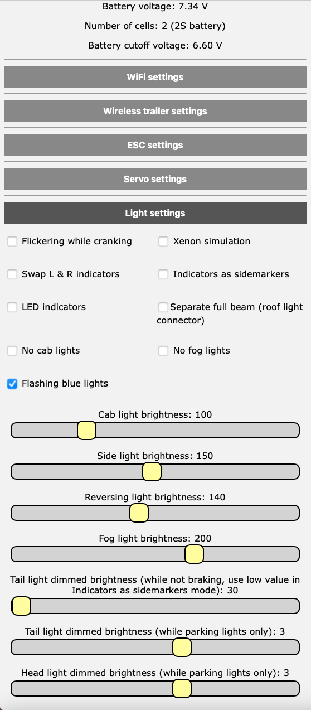
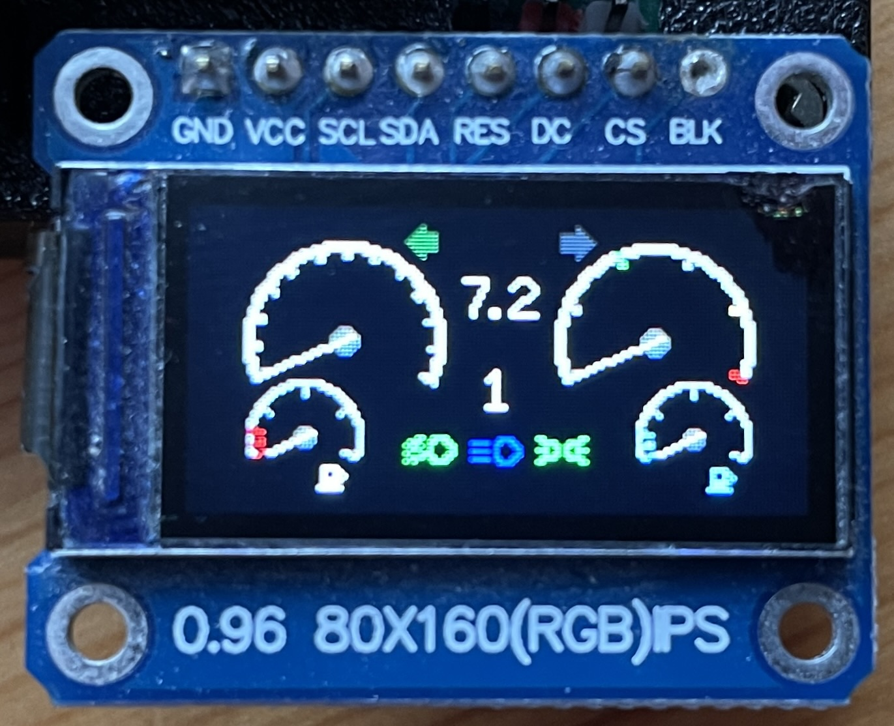

# This is an Arduino RC engine sound & light controller for ESP32

[](https://github.com/TheDIYGuy999/Rc_Engine_Sound_ESP32/releases/latest)
[](https://github.com/TheDIYGuy999/Rc_Engine_Sound_ESP32/releases/latest)
[](https://github.com/TheDIYGuy999/Rc_Engine_Sound_ESP32/graphs/contributors)

It's based on the ATmega 328 version: https://github.com/TheDIYGuy999/Rc_Engine_Sound
and on bitlunis Halloween example: https://github.com/bitluni/MotionPumpkin

Wiring and software installation instructions see further down.
Arduino IDE or Visual Studio Code (with Platform IO extension) are supported.

Video series: https://www.youtube.com/playlist?list=PLGO5EJJClJBCjIvu8frS7LrEU3H2Yz_so

************************************************************************
You can find the changes in the [Changelog](documentation/Changelog.md).
************************************************************************

Discussion and support thread (in German & English): https://www.rc-modellbau-portal.de/index.php?threads/esp32-arduino-rc-sound-und-licht-controller.7183/

Fully assembled, tested and working 30 pin SMD version with switch mode PSU & display connector.
Order it here: https://www.pcbway.com/project/shareproject/Arduino_RC_engine_sound_light_controller_for_ESP32_a9334731.html


New: STL data for nice 3D printed housing available:
https://thediyguy999.github.io/TheDIYGuy999_ESP32_Web_Flasher/products.html


New: Compact version for trailer or tractor:
https://thediyguy999.github.io/TheDIYGuy999_ESP32_Web_Flasher/products.html


New: RZ7886 7A ESC:
https://thediyguy999.github.io/TheDIYGuy999_ESP32_Web_Flasher/products.html


New: wireless built-in configuration website 192.168.4.1


New: LCD dashboard (original by Frevic)

https://www.facebook.com/profile.php?id=100066616574355

LCD dashboard (original by Gamadril)


Fully assembled, tested and working 30 pin SMD version, manufactured and pre-assembled by https://www.pcbway.com


Fully assembled, tested and working 30 pin thru hole version


Compact version for excavator (IBUS & sound only, supplied by 6V BEC)


## Features:
- Unique vehicle mass inertia simulation (connect your crawler type ESC to pin 33). Throttle output is altered during shifting of a mechanical 3 speed transmission for smooth shifting, gear protection and realistic sound. Works just fine with TAMIYA 3 speed transmissions. Should work as well with crawler 2 speed transmissions. The ESC is controlled by a state machine with the following states: driving forward & reverse (varible acceleration, depending on throttle position), neutral, braking forward & reverse (variable deceleration with fine granularity, according to "reverse throttle" position). It also allows to control the brake lights, the brake sound, the reversing light & the reversing beep sound properly. Acceleration & deceleration (coasting & braking) are adjustable separately for each gear to ensure maximum realism.
- Unique "virtual clutch" allows to rev the engine below an adjustable ESC output speed. Above, the clutch engages and ensures, that the engine sound is in synch with the wheel RPM. Sounds and behaves just great in combination with a shifting transmission!
- Simulated automatic transmission with torque converter (if your vehicle does not have a real shifting transmission)
- Simulated double clutch transmission
- simulated, manually shifted 3 speed transmission (new in v5.5)
- Virtual, switchable neutral allows to rev the engine while standing still
- Jake brake (simulated pneumatic engine brake, mainly used in US trucks)
- Tracked mode (dual throttle input on CH2 & CH3, for tanks, diggers etc. No ESC control support in this mode. (New in v4.5)
- Tank cannon sound & flash (New in v4.6)
- Triggering multiple latching and non latching actions (sounds, lights) per analog channel, using the rcTrigger library (New in v4.7, still experimental)
- Many selectable sounds: engine cranking, engine idling, engine revving, turbo whining, diesel ignition "knock", wastegate valve, horns, sirens, reversing beep, air brake, parking brake, gear shifting etc.
- Realistic engine sound is mixed together on the fly from up to 4 sounds: engine idling, turbo, wastegate (all with variable sampling rate), Diesel ignition knock (fixed sampling rate, so it does not vary in pitch)
- Load (throttle position) dependent volume sounds: idle, rev, Diesel knock
- Engine RPM dependent volume sounds: turbo, wastegate
- Dozens of engine & other sounds included, you can also compose your own, using Audacity and bitlunis conversion tool (link above)
- Engine RPM range and inertia adjustable, volume of all sounds adjustable, engine sounds separatly for load and idling.
- Many other paramerets can be adjusted. All adjustments are easily accessible in "adjustmentsXyz.h"
- Sound files up to 22'050Hz, 8bit, mono can be used
- Compatible input signals: PWM, PPM, SBUS (inverted & non inverted signals), IBUS
- Works best with a PAM8403 amplifier module, connected to pin 25 & 26, via 10kOhm resistors & a 10kOhm potentiometer (see schematic below)
- The engine RPM is calculated according to RC signal input on pin 13 *** CAUTION, 3.3V max. on all pins! *** 330 Ohm resistors on all I/O pins recommended!
- Non linear throttle curves can be generated in "curves.h"
- Light effects: headlights (high & low beam), tail lights, brake lights, fog lights, roof lights, cab lights, reversing light, indicators (turn signals), hazard lights, blue light etc. (max. 12 outputs)
- Engine vibration simulation, using a shaker motor with excentric weight: Strong vibration while cranking, medium wlile idling, slight while revving
- Adjustable volume (via remote)
- Use an ESP32, CPU frequency must be set to 240MHz
- Eagle schematic & board file included. Pre made Gerber files allow you to order your board easily.
- included, easy to use .wav to .h sound file converter
- Channels can easily be assigned, using "remoteSetup.h"
- Pre made configuration profiles for Flysky FS-i6X and Arduino Mirco RC remote (new in v.5.5)
- Variable length for horn & siren, using loop area in sound files (new in v5.6)
- BUS decoder for steering servo and shifting servo (connect servos to CH1 & CH2) pins
- Trailer coupler (5th wheel) servo can be connected to the CH4 pins (not in PWM communication mode)
- TAMIYA trailer presence switch can be connected to pin 32 (depending on "#define THIRD_BRAKELIGHT" setting in "6_adjustmentsLights.h" tab)
- Support for non linear throttle and steering curves (for more accurate control around center position). Use "EXPONENTIAL_THROTTLE" & "EXPONENTIAL_STEERING" in "2_adjustmentsRemote.h"
- Support for HOBBYWING Quicrun Fusion Motor / ESC combo. Use "#define QUICRUN_FUSION" in "3_adjustmentsESC.h"
- Support for winch, connected to CH3 (BUS communication mode only). Use "#define MODE2_WINCH" in "7_adjustmentsServo.h" The mode 2 button is then used to switch between horn / siren sontrol and winch control via CH4. The winch is controlled by an old RC servo driver board. The speed and neutral settings are done using "CH3L", CH3C" and CH3R" positions.
- Support for LCD dashboard
- Support for 2812 Neopixel LED (GPIO0)
- Support for hydlaulic excavators (hydraulic pump, hydraulic flow, track rattling sounds). Use #define FLYSKY_FS_I6S_EXCAVATOR profile for remote
- ESP-NOW based 2.4 GHz wireless trailer control support
- An RZ7886 motor driver IC can be used instead of a standard crawler type RC ESC
- Battery low discharge protection options
- Switchable crawler mode (with just minimal virtual inertia)
- Wireless configuration website 192.168.4.1

## On the todo list:
- cornering lights (on the beacon outputs)
- Hazards switching on, if engine off in AUTO_LIGHTS mode

## Known issues:
- Arduino IDE 1.8.7 or older is not supported and will cause compiler errors!
- The ESP32 does not work on macOS Big Sur 11.x, but this issue can be fixed easily as described here: [Big Sur Fix](BigSurFix.md) (for v1.04)
- macOS Monterey 10.3 does not include Python 2 anymore. For Arduino IDE, you have to install Python 3 and to change the path in pPlatform.txt according to:
https://forum.arduino.cc/t/mac-os-update-killed-esp32-sketch/969580/24

## How to create new .h sound files:

### Audacity:
- import the WAV sound file you want in Audacity
- convert it to mono, if needed
- on the bottom left, select project frequency 22'050Hz
- search for a cyclic pattern in the idle sound (the amount of ignition pulses is usually the same as the cylinder number), cut the "idle" sample to exactly this length, have a close look at the zero crossings to avoid clicking noises. The loudest peak should always be at the end of the sample.
- do the same with the "rev" sound. It will be 2 - 4 times shorter than the "idle" sample, depending on the engine and rpm of the "rev" sample
- change the "Rate" (dropdown on the left of the sample) of the "rev" sample, until the length is the same as in the "idle" sample. This is very important!
- duplicate a part of the "rev" sample (the one with the original, unchanged "Rate" speed). This is the "knock" sample. Cut it to this max length: "Idle" length / number of cylinders / rpm range "MAX_RPM_PERCENTAGE" (usually 2 - 4 or 200 - 400%)
- adjust the volume of all samples, so that the entire dynamic range is used
- you may also want to apply high pass or low pass filters to fine tune the sound
- select > export audio > selected audio > WAV > 8-bit-PCM

### Convert the .wav file with the modified converting tool (new in v5.2):

- open the included "Audio2Header.html" converter in your browser. It is located in the "tools" folder
- adjust the export file format (no changes required)
- select the export file type, depending on the sound you are converting (idle, rev, horn etc.)
- open the wav file you want to convert
- a .h file is generated and downloaded
- move it to your "sketch/vehicles/sounds" directory

### Include the new header file with your sound in your vehicle preset, adjust settings until you are happy:
- include this .h file in "Adjustments.h" > "yourVehiclePreset.h"
- knock sound settings:
  - "dieselKnockInterval" = number of cylinders
  - uncomment "V8" for V8 engines, R6 for inline 6 engines or "V2" for V2 (Harley) engines
  - adjust "dieselKnockAdaptiveVolumePercentage" (how loud the "silent" knock pulses are compared with the loud ones), only active, if defined "V8", "R6"  or "V2"
- play with the other volumes, start-, end- and switch-points until you are happy
- the "rev" sound is optional and only active, if "REV_SOUND" is defined (// removed)
- adjust the transition from the "idle" to the "rev" sound, using "revSwitchPoint", "idleEndPoint", "idleVolumeProportionPercentage". This step is very important and can make a huge difference!

### Compile the new sketch:
- compile and upload the sketch in Arduino IDE
- the new sound should now be ready

## Schematic example (use PDF for current version!):


## PCB
### Included PCB files:
- See hardware folder

### Recommended manufacturer:
https://www.pcbway.com (including SMD assembling service, use Gerbers.zip for board, it also includes BOM. xlsx and CPL.xlsx, if you want to use the SMT assembling service)
How to order pre assembled boards see /Eagle_PCB/How To Order Your PCB.pdf

### The easiest way to order the 30pin SMD version with display connector:
https://www.pcbway.com/project/shareproject/Arduino_RC_engine_sound_light_controller_for_ESP32_a9334731.html

### Assembling tutorial (for the 30 pin SMD version without display connector):
https://www.youtube.com/watch?v=csQgTfxRd8Y&t=2s

### Assembling tutorial (for the 36 pin version):
https://www.youtube.com/watch?v=Vfaz3CzecG4&list=PLGO5EJJClJBCjIvu8frS7LrEU3H2Yz_so&index=13

## Wiring:
### Before you begin:
- This device is not protected against wrong polarity!
- Always use series resistors for LED headers (except TAMIYA trailer header)
- Maximum input voltage on "Sig" pins = 3.3V (be careful with very old receivers, which may deliver 5V)
- It is recommended to use a fuse between your battery and the sound controller / ESC

### Supply for audio amplifier, shaker motor and LED:
- Use an Y-cable between your battery, your ESC and The "X1" terminal. Battery voltage range is 7 - 12.6V

### Supply for ESP32:
- The ESP32 is not supplied through the "X1" terminal
- It can be supplied through the Micro USB header
- or through the +V and GND pin row on the top of the board (the voltage is usually coming from the BEC in your ESC, which needs to be connected to the "ESC" header)

### ESC wiring:
- Connect a Hobbywing 1080 ESC to the ESC header (GND, V+ and Sig)
- Adjust the ESC parameters, using the programming card as described on the top of "Adjustments.h"
- I do not recommend any other ESC
- The ESC is controlled by the cound controller, rather than directly by the receiver. This allows to use the unique "virtual inertia" feature. NOTE: Use this feature at your own risk! I'm not responsible, if any damage is caused. It's running very stable and I never had an issue, but you never know.
- "escPulseSpan" can be used to limit the top speed of your vehicle. 500 = not limited, anything above 500 will limit the top speed

### Receiver wiring for PWM servo signals (the most common wiring):
- Channel assignment according to "remoteSetup.h" and remoteSetup.xlsx", easily adjustable (new in v5.5). It is important to plug in the wires according to the channel assignment
- CH5 & 6 are coming in via the "35" & PPM" headers
- At least one CH needs to be connected, using a 3 pin wire, so that GND and V+ are connected as well (receiver supply)
- CH1 - 4 headers are pairs, wired in parallel. This allows to feed servo signals through, eliminating the need for Y-cables
- Note that you need to change the configuration as described below, if you want to use this wiring method

### Receiver wiring for PPM signals:
- Internal channel assignment as above
- Connect a 3 pin wire fom your receiver PPM header to the RX (changed in v5.5, was PPM) header on the sound controller (Sig, V+, GND)
- Note that you need to change the configuration as described below, if you want to use this wiring method
- 8 channels can be read in this mode

### Receiver wiring for SBUS signals (recommended):
- Internal channel assignment as above
- Connect a 3 pin wire fom your receiver SBUS header to the SBUS header on the sound controller (Sig, V+, GND)
- The "Sig" pin on the SBUS header is 5V tolerant
- 13 channels can be read in this mode

### Receiver wiring for IBUS signals:
- Internal channel assignment as above
- Connect a 3 pin wire fom your receiver IBUS header to the RX header on the sound controller (Sig, V+, GND)
- 13 channels can be read in this mode

### Speakers
- 4 or 8 ohms speakers are compatible
- You can use one or two speakers
- never use two speakers in parallel on a single header
- never use two headers in parallel to drive one speaker
- never connect capacitors to the speaker headers

### LED
- The LED need to be wired "common positive". This means, the long LED legs are all connected together and connect to the 5V rail, coming from the on board regulator
- All LED (except the ones, which are connected to the TAMIYA trailer connector) need a series resistor
- Calculate the reqired resistor according to: http://ledcalc.com (supply voltage = 5V)
- It is not recommended to wire LED in parallel, sharing the series resistor
- Support for WS2812 Neopixel LED (details and wiring see "6_adjustmentsLights.h")

### LCD dashboard
- See "9_adjustmentsDashboard.h"

### Shaker
- The shaker is used for engine vibration simulation. The speed can be adjusted in the vehicle configuration and will vary depending on the engine state and rpm
- It needs to be connected to the "shaker" header and is supplied by the on board 5V regulator. The negative side is switched by the on board mosfet
- Please note, that the used mosfet needs to be a logic level type. Otherwise the shaker will not work!
- The motor should not draw more than about 300mA @ 5V. I'm using a shaker motor from GT Power.

### RZ7886 7A DC motor driver instead of an ESC:
It is intended for smaller scale vehicles like WPL

#### Prototype:


#### Order your motor driver PCB here:
https://www.pcbway.com/project/shareproject/RZ7886_based_ESC_for_ESP32_Sound_and_Light_Controller_f8f4a805.html

## Software:
### Required software for code uploading and editing:
- Arduino IDE (not recommnded): https://www.arduino.cc/en/Main/Software
- or Visual Studio Code with PlatformIO extension (recommended): https://code.visualstudio.com
- Visual Studio also requires this software (restart VS Code afterwards) in order to be able to synchronise libraries: https://git-scm.com/download

### Downloading and preparing the code with Arduino IDE:
- Download the code from here (hit "Code > Download zip"): https://github.com/TheDIYGuy999/Rc_Engine_Sound_ESP32
- Unzip the folder, if required
- Remove the "-master" part of the folder name
- Install libraries and board definitions below first, restart Arduino IDE
- Open "scr.ino" with a double click (Arduino IDE should start)

### Required ESP32 board definition (not required, if Visual Studio Code is used as IDE):
- Install it according to: https://randomnerdtutorials.com/installing-the-esp32-board-in-arduino-ide-windows-instructions/
- Use v1.04, v1.05 or newer are causing reboot issues!
- Adjust settings according to:


### Required libraries. You need to install ALL of them, if using Arduino IDE. Not required, if Visual Studio Code is used as IDE:
- statusLED: https://github.com/TheDIYGuy999/statusLED
- SBUS: https://github.com/TheDIYGuy999/SBUS
- rcTrigger: https://github.com/TheDIYGuy999/rcTrigger
- IBUS: https://github.com/bmellink/IBusBM
- TFT: https://github.com/Bodmer/TFT_eSPI
- FastLED: https://github.com/FastLED/FastLED    

Download them in the same manner as the main code above. Store the folders in your "Arduino/libraries" path.
Install them according to: https://www.arduino.cc/en/Guide/Libraries

### Uploading the code to the board:
- IMPORTANT: Depending on your board, you may have to press and hold the "BOOT" button, if the IDE just shows "Connecting........_____...." Release it, as soon as the upload starts.
- On macOS Big Sur, you need to apply the following fix (Arduino IDE only):  [Big Sur Fix](BigSurFix.md)

### Visual Studio Code (instead of Arduino IDE) overiew:


## Adjusting things in "X_Xyz.h":
### Vehicle selection:

Note, that in v5.5 the former "Adjustments.h" configuration file was divided into multiple files.

Uncomment (remove //) the vehicle you want in "Adjustments.h". Never uncomment more than one vehicle!
Note, that you need to re-upload the code after you changed the settings. Otherwise it will not take effect.
Select >Sketch > Upload to upload the code. Important! Always lift your vehicle off the ground while uploading.

If you want to make a new vehicle, copy vehicles/00_Master.h, store it with your vehicle name. Then edit the settings as you like, add links to the sound files you want.
Afterwards add a link to your vehicle.h (see examples below) and uncomment it

```
#include <Arduino.h>

// VEHICLE SETTINGS ****************************************************************************************************
// Select the vehicle preset you want (uncomment the one you want, remove //, never more than one)

// Master --------
//#include "vehicles/00_Master.h" // This master preset file contains all available sound files, which are not used in existing vehicle presets

// US trucks --------
//#include "vehicles/CaboverCAT3408.h" // Cabover truck with Caterpillar 3408 V8 Diesel
//#include "vehicles/PeterbiltDetroit8v92.h" // Peterbilt 359 with Detroit 8V92 V8 2 stroke Diesel
//#include "vehicles/KenworthW900ADetroit8V71.h" // Kenworth W900A with Detroit 8V71 V8 2 stroke Diesel
//#include "vehicles/KenworthW900ACAT3408.h" // Kenworth W900A with Caterpillar 3408 V8 Diesel (King Hauler)
//#include "vehicles/CAT3408OpenPipes.h" // Kenworth W900A with Caterpillar 3408 V8 Diesel and open pipes
//#include "vehicles/KenworthW900ACAT3408new.h" // Kenworth W900A with Caterpillar 3408 V8 Diesel (good bass speaker required)
//#include "vehicles/KenworthCummins335.h" // 1950ies Kenworth with Cummins 335 R6 Diesel
//#include "vehicles/MackSuperLiner.h" // MACK Super Liner
//#include "vehicles/M35.h"// AM General M35 "deuce and a half" military truck, turbocharged R6 universal fuel engine
//#include "vehicles/US_Firetruck.h"// US firetruck with CAT3408 V8 and Allison 6 speed automatic (horn & siren loop capable)
//#include "vehicles/FreightlinerCummins350.h" // Freightliner Cabover with Cummins 350 R6 Diesel

// EU trucks --------
//#include "vehicles/Tatra813.h" // Tatra 813 8x8 V12 Diesel military truck (old version for comparison, don't use it)
//#include "vehicles/Tatra813new.h" // Tatra 813 8x8 V12 Diesel military truck
//#include "vehicles/UnimogU1000.h" // Umimog U 1000 with turbocharged R6 Diesel incl. Feuerwehr "Martinshorn" siren
//#include "vehicles/MercedesActros1836.h" // Mercedes Actros 1863 or 3363 truck with R6 Diesel
//#include "vehicles/MercedesActrosV6.h" // Mercedes Actros V6 Race Truck incl. tire squealing
//#include "vehicles/ScaniaV8_50ton.h" // SCANIA V8 50 ton truck. Unknown model. Bad quality!
//#include "vehicles/ScaniaV8.h" // SCANIA V8 truck, unknown model
//#include "vehicles/1000HpScaniaV8.h" // 1000 HP SCANIA V8 truck with open pipes. Insane sound! Good bass speakers reqired
//#include "vehicles/Scania143.h" // SCANIA 143 V8 - the legend! The best sounding in my opinion
//#include "vehicles/ScaniaV8Firetruck.h" // SCANIA V8 firetruck, automatic Allison 6 speed transmission with torque converter, "Martinshorn" siren
//#include "vehicles/VolvoFH16_750.h" // Volvo FH16 750 truck. Inline 6, 750 horses, open pipes!
//#include "vehicles/VolvoFH16_OpenPipe.h" // Volvo FH truck. Inline 6, open pipes, alternative version
//#include "vehicles/ManTgx.h" // MAN TGX 680 V8 truck
//#include "vehicles/ManKat.h" // MAN KAT V8 Diesel German Bundeswehr military truck
//#include "vehicles/MagirusDeutz256.h" // Magirus Deutz 256 air coolded V8 Diesel truck
//#include "vehicles/MagirusMercur125.h" // Magirus Mercur air coolded V6 Diesel truck
//#include "vehicles/Saurer2DM.h" // Swiss Saurer 2DM R6 Diesel truck

// Russian trucks --------
//#include "vehicles/Ural4320.h" // URAL 4320 6x6 V8 Diesel military truck
#include "vehicles/Ural375D.h" // URAL 375D 6x6 V8 petrol military truck
//#include "vehicles/URAL375.h" // URAL 375D 6x6 V8 petrol military truck (new version with better V8 sound, but good bass speaker required)
//#include "vehicles/GAZ66.h" // GAZ-66 V8 petrol military truck

// Russian tanks -------
//#include "vehicles/IS3.h" // IS-3 WW2 battle tank, V12 Diesel (dual ESC mode, good bass speaker required)

// Tractors -------
//#include "vehicles/KirovetsK700.h" // Russian Kirovets K700 monster tractor. Extreme turbo sound!

// Excavators -------
//#include "vehicles/Caterpillar323Excavator.h" // Caterpillar 323 excavator (use "FLYSKY_FS_I6S_EXCAVATOR" remote profile)

// Dumpers -------
//#include "vehicles/Benford3TonDumper.h" // Benford 3 ton dumper

// US motorcycles --------
//#include "vehicles/HarleyDavidsonFXSB.h" // Harley Davidson FXSB V2 motorcycle

// US cars --------
//#include "vehicles/ChevyNovaCoupeV8.h" // 1975 Chevy Nova Coupe V8
//#include "vehicles/1965FordMustangV8.h"// 1965 Ford Mustang V8
//#include "vehicles/Chevy468.h" // Chevy 468 big block V8

// EU cars --------
//#include "vehicles/VwBeetle.h" // VW Käfer / Beetle
//#include "vehicles/JaguarXJS.h" // Jaguar XJS V12, manual transmission
//#include "vehicles/JaguarXJSautomatic.h" // Jaguar XJS V12, automatic transmission
//#include "vehicles/MGBGtV8.h" // MGB GT V8, manual transmission
//#include "vehicles/LaFerrari.h" // Ferrari LaFerrari, V12, 6 speed double clutch transmission

// US SUV & Pickups --------
//#include "vehicles/JeepGrandCherokeeTrackhawk.h" // Jeep Grand Cherokee Trackhawk V8 monster SUV with supercharger, 6 speed automatic
//#include "vehicles/FordPowerstroke.h" // Ford Powerstroke 7.3l V8 Diesel, 6 speed automatic (good bass speaker required)
//#include "vehicles/RAM2500_Cummins12V.h" // Dodge RAM 2500 with inline 6, 12V Cummins 5.9l Diesel, manual transmission
//#include "vehicles/RAM2500_Cummins12Vautomatic.h" // Dodge RAM 2500 with inline 6, 12V Cummins 5.9l Diesel, automatic transmission
//#include "vehicles/GMCsierra.h" // GMC Sierra V8 pickup, 3 speed automatic transmission
//#include "vehicles/ChevyNovaCoupeV8_P407.h" // 1975 Chevy Nova Coupe V8, special version for HG-P407, 3 speed automatic transmission
//#include "vehicles/JeepWranglerRubicon392V8.h" // 2021 Jeep Wrangler Rubicon HEMI 392 V8 (starter needs rework)
//#include "vehicles/JeepWranglerRubicon392V8_2.h" // 2021 Jeep Wrangler Rubicon HEMI 392 V8 (insane bass!)

// EU SUV --------
//#include "vehicles/DefenderV8Automatic.h" // Land Rover Defender 90 V8 automatic (very nice V8 with lots of bass)
//#include "vehicles/DefenderV8OpenPipeAutomatic.h" // Land Rover Defender 90 V8 automatic, open pipes (optimised for smaller speakers)
//#include "vehicles/DefenderV8CrawlerAutomatic.h" // Land Rover Defender 90 V8 automatic crawler
//#include "vehicles/DefenderTd5.h" // Land Rover Defender 90 Td5 R5 Diesel

// Asian SUV --------
//#include "vehicles/LandcruiserFJ40.h" // Landcruiser Fj40 with inline 6 petrol engine
//#include "vehicles/LandcruiserFJ40Diesel.h" // Landcruiser Fj40 with inline 6 12H Turbo Diesel engine
//#include "vehicles/LandcruiserFJ40Diesel2.h" // Landcruiser Fj40 with inline 6 12H Turbo Diesel engine
//#include "vehicles/HiluxDiesel.h" // Hilux Diesel with inline 6 12H Turbo Diesel engine (for HG-P407)

// US locomotives --------
//#include "vehicles/UnionPacific2002.h" // Union Pacific 2002 SD70M locomotive with enormous, low revving 16 cylinder Diesel

// Planes --------
//#include "vehicles/MesserschmittBf109.h" // Messerschmitt BF 109 WW2 German V12 plane

// Generic Diesels --------
//#include "vehicles/generic6zylDiesel.h" // Generic inline 6 Diesel, no turbo, manual transmission (optimised for smaller speakers)
```

### Interface type (communication mode) selection:

Note, that the default communication mode is SBUS. You need to change it as follows, if you want to use classic RC servo signals.

#### PWM (classic RC signals on "CH1" - "CH4", "35" & "PPM" headers, the most common interface)
```
// COMMUNICATION SETTINGS **********************************************************************************************
// Choose the receiver communication mode (never uncomment more than one!) !!! ADJUST THEM BEFORE CONNECTING YOUR RECEIVER AND ESC !!!

// PWM servo signal communication (CH1 - CH4, 35, PPM headers, 6 channelschannelSetup.h) --------
// PWM mode active, if SBUS, IBUS and PPM are disabled (// in front of #define)

// SBUS communication (SBUS header, 13 channels. This my preferred communication protocol)--------
//#define SBUS_COMMUNICATION // control signals are coming in via the SBUS interface (comment it out for classic PWM RC signals)
boolean sbusInverted = true; // false = wired to non standard (inverted) SBUS signal (for example from "Micro RC" receiver)

// IBUS communication (RX header, 13 channels not recommended, NO FAILSAFE, if bad contact in iBUS wiring!) --------
//#define IBUS_COMMUNICATION // control signals are coming in via the IBUS interface (comment it out for classic PWM RC signals)

// SUMD communication (RX header, 12 channels, For Graupner remotes) --------
//#define SUMD_COMMUNICATION // control signals are coming in via the SUMD interface (comment it out for classic PWM RC signals)

// PPM communication (RX header, 8 channels, working fine, but channel signals are a bit jittery) --------
//#define PPM_COMMUNICATION // control signals are coming in via the PPM interface (comment it out for classic PWM RC signals)
```

#### PPM (multiple channels pulse pause modulation, wired to "RX" header, 8 channels)
```
// COMMUNICATION SETTINGS **********************************************************************************************
// Choose the receiver communication mode (never uncomment more than one!) !!! ADJUST THEM BEFORE CONNECTING YOUR RECEIVER AND ESC !!!

// PWM servo signal communication (CH1 - CH4, 35, PPM headers, 6 channelschannelSetup.h) --------
// PWM mode active, if SBUS, IBUS, and PPM are disabled (// in front of #define)

// SBUS communication (SBUS header, 13 channels. This my preferred communication protocol)--------
//#define SBUS_COMMUNICATION // control signals are coming in via the SBUS interface (comment it out for classic PWM RC signals)
boolean sbusInverted = true; // false = wired to non standard (inverted) SBUS signal (for example from "Micro RC" receiver)

// IBUS communication (RX header, 13 channels not recommended, NO FAILSAFE, if bad contact in iBUS wiring!) --------
//#define IBUS_COMMUNICATION // control signals are coming in via the IBUS interface (comment it out for classic PWM RC signals)

// SUMD communication (RX header, 12 channels, For Graupner remotes) --------
//#define SUMD_COMMUNICATION // control signals are coming in via the SUMD interface (comment it out for classic PWM RC signals)

// PPM communication (RX header, 8 channels, working fine, but channel signals are a bit jittery) --------
#define PPM_COMMUNICATION // control signals are coming in via the PPM interface (comment it out for classic PWM RC signals)
```

#### SBUS (recommended, default setting, wired to "SBUS" header, 13 channels)
```
// COMMUNICATION SETTINGS  ********************************************************************************************************************
// Choose the receiver communication mode (never uncomment more than one!) !!! ADJUST THEM BEFORE CONNECTING YOUR RECEIVER AND ESC !!!

// PWM servo signal communication (CH1 - CH4, 35, PPM headers, 6 channels) --------
// PWM mode active, if SBUS, IBUS, and PPM are disabled (// in front of #define)

// SBUS communication (RX header, 13 channels. This is my preferred communication protocol)--------
#define SBUS_COMMUNICATION // control signals are coming in via the SBUS interface (comment it out for classic PWM RC signals)
boolean sbusInverted = false; // false = wired to non standard (inverted) SBUS signal (for example from my "Micro RC" receiver)
uint32_t sbusBaud = 100000; // Standard is 100000. Try to lower it, if your channels are coming in unstable. Working range is about 96000 - 104000.

// IBUS communication (RX header, 13 channels not recommended, NO FAILSAFE, if bad contact in iBUS wiring!) --------
//#define IBUS_COMMUNICATION // control signals are coming in via the IBUS interface (comment it out for classic PWM RC signals)

// SUMD communication (RX header, 12 channels, For Graupner remotes) --------
//#define SUMD_COMMUNICATION // control signals are coming in via the SUMD interface (comment it out for classic PWM RC signals)

// PPM communication (RX header, 8 channels, working fine, but channel signals are a bit jittery) --------
//#define PPM_COMMUNICATION // control signals are coming in via the PPM interface (comment it out for classic PWM RC signals)
```

SBUS non standard signal (if your receiver sends a non-standard SBUS signal):
```
boolean sbusInverted = false; // false = wired to non standard (inverted) SBUS signal (for example from "Micro RC" receiver)
```

SBUS standard signal (default, used in most cases)
```
boolean sbusInverted = true; // false = wired to non standard (inverted) SBUS signal (for example from "Micro RC" receiver)
```

SBUS baudrate fine adjustment. 100000 ist standard. With some receivers, the indicators and other functions may be randomly triggered, because there are bit errors.
This variable allows to fine adjust the baudrate to solve this problem.
```
uint32_t sbusBaud = 100000; // Standard is 100000. Try to lower it, if your channels are coming in unstable. Working range is about 96000 - 104000.
```

#### IBUS (not recommended, NO FAILSAFE, if bad contact in iBUS wiring! "RX" header, 13 channels)
```
// COMMUNICATION SETTINGS **********************************************************************************************
// Choose the receiver communication mode (never uncomment more than one!) !!! ADJUST THEM BEFORE CONNECTING YOUR RECEIVER AND ESC !!!

// PWM servo signal communication (CH1 - CH4, 35, PPM headers, 6 channelschannelSetup.h) --------
// PWM mode active, if SBUS, IBUS, SERIAL and PPM are disabled (// in front of #define)

// SBUS communication (SBUS header, 13 channels. This my preferred communication protocol)--------
//#define SBUS_COMMUNICATION // control signals are coming in via the SBUS interface (comment it out for classic PWM RC signals)
boolean sbusInverted = true; // false = wired to non standard (inverted) SBUS signal (for example from "Micro RC" receiver)

// IBUS communication (RX header, 13 channels not recommended, NO FAILSAFE, if bad contact in iBUS wiring!) --------
#define IBUS_COMMUNICATION // control signals are coming in via the IBUS interface (comment it out for classic PWM RC signals)

// SUMD communication (RX header, 12 channels, For Graupner remotes) --------
//#define SUMD_COMMUNICATION // control signals are coming in via the SUMD interface (comment it out for classic PWM RC signals)

// PPM communication (RX header, 8 channels, working fine, but channel signals are a bit jittery) --------
//#define PPM_COMMUNICATION // control signals are coming in via the PPM interface (comment it out for classic PWM RC signals)
```

#### SUMD (For Graupner remotes "RX" header, 12 channels)
```
// COMMUNICATION SETTINGS  ********************************************************************************************************************
// Choose the receiver communication mode (never uncomment more than one!) !!! ADJUST THEM BEFORE CONNECTING YOUR RECEIVER AND ESC !!!

// PWM servo signal communication (CH1 - CH4, 35, PPM headers, 6 channels) --------
// PWM mode active, if SBUS, IBUS, and PPM are disabled (// in front of #define)

// SBUS communication (SBUS header, 13 channels. This is my preferred communication protocol)--------
//#define SBUS_COMMUNICATION // control signals are coming in via the SBUS interface (comment it out for classic PWM RC signals)
boolean sbusInverted = false; // false = wired to non standard (inverted) SBUS signal (for example from my "Micro RC" receiver)

// IBUS communication (RX header, 13 channels not recommended, NO FAILSAFE, if bad contact in iBUS wiring!) --------
//#define IBUS_COMMUNICATION // control signals are coming in via the IBUS interface (comment it out for classic PWM RC signals)

// SUMD communication (RX header, 12 channels, For Graupner remotes) --------
#define SUMD_COMMUNICATION // control signals are coming in via the SUMD interface (comment it out for classic PWM RC signals)

// PPM communication (RX header, 8 channels, working fine, but channel signals are a bit jittery) --------
//#define PPM_COMMUNICATION // control signals are coming in via the PPM interface (comment it out for classic PWM RC signals)
```

## Adjusting things in "vehicles/yourVehiclePreset.h":
### Shaker
adjust the shaker power for the different engine states to fit your needs:
```
// Shaker parameters (simulating engine vibrations) ---------------------------------------------------------------------
const uint8_t shakerStart = 100; // Shaker power while engine start (max. 255, about 100)
const uint8_t shakerIdle = 49; // Shaker power while idling (max. 255, about 49)
const uint8_t shakerFullThrottle = 40; // Shaker power while full throttle (max. 255, about 40)
const uint8_t shakerStop = 60; // Shaker power while engine stop (max. 255, about 60)
```
### More to come...

## Prototypes:


2019 - 2023, TheDIYGuy999
